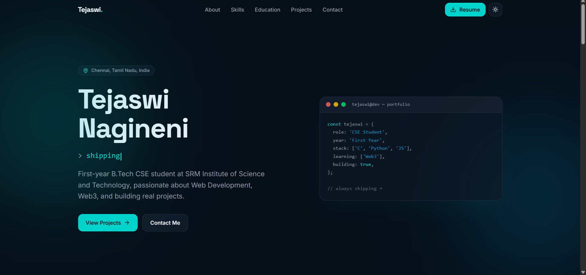

# Tejaswi Nagineni Portfolio



> A personal portfolio website for Tejaswi Nagineni, a Computer Science Engineering student building with modern web technologies and exploring Web3.

## Live Website

Visit the deployed portfolio: **[portfolio-umber-omega-5ng2zm0d2j.vercel.app](https://portfolio-umber-omega-5ng2zm0d2j.vercel.app/)**

## About The Project

This project is a responsive, single-page portfolio designed to present Tejaswi's background, technical skills, education, projects, goals, and contact information in one focused experience.

The site uses a dark-first visual theme with support for light mode, responsive layouts for mobile and desktop screens, reusable React components, and optimized Next.js rendering. The content is organized into independent sections so that the portfolio can grow as new projects and experience are added.

## Features

- Responsive portfolio layout for desktop, tablet, and mobile screens
- Hero section with personal introduction and primary calls to action
- About section describing academic interests and development focus
- Skills section for presenting technical capabilities
- Education section for academic background
- Projects section for showcasing selected work
- Goals section describing future direction and ambitions
- Contact section with social and communication links
- Downloadable resume available from the public assets directory
- Dark and light theme support with the selected theme persisted locally
- Responsive navigation with section links
- Accessible semantic page structure and keyboard-friendly controls
- SEO metadata and Open Graph information configured in the root layout
- Vercel Analytics enabled for production builds

## Tech Stack

### Core

- [Next.js](https://nextjs.org/) 16 with the App Router
- [React](https://react.dev/) 19
- [TypeScript](https://www.typescriptlang.org/)

### Styling And UI

- [Tailwind CSS](https://tailwindcss.com/) 4
- CSS custom properties and global styles for theming
- [Lucide React](https://lucide.dev/) for interface icons
- `class-variance-authority`, `clsx`, and `tailwind-merge` for reusable class composition

### Deployment And Monitoring

- [Vercel](https://vercel.com/) deployment
- [Vercel Analytics](https://vercel.com/analytics) in production

## Getting Started

### Prerequisites

Install the following before starting development:

- Node.js 20 or newer
- pnpm 12 or newer

You can confirm the installed versions with:

```bash
node --version
pnpm --version
```

### Installation

Clone the repository and install the dependencies:

```bash
git clone https://github.com/tejaswinrsri-sudo/Portfolio.git
cd Portfolio
pnpm install
```

### Run The Development Server

Start the local Next.js development server:

```bash
pnpm dev
```

Open [http://localhost:3000](http://localhost:3000) in a browser. Next.js will reload the page automatically when source files change.

### Create A Production Build

Build and run the production version locally:

```bash
pnpm build
pnpm start
```

The production server is available at [http://localhost:3000](http://localhost:3000).

## Available Scripts

| Command | Description |
| --- | --- |
| `pnpm dev` | Starts the development server |
| `pnpm build` | Creates an optimized production build |
| `pnpm start` | Starts the production server |

## Project Structure

```text
.
├── app/
│   ├── globals.css       Global styles, tokens, and theme rules
│   ├── layout.tsx        Root layout, metadata, fonts, and analytics
│   └── page.tsx          Main page composition
├── components/
│   ├── about.tsx         About section
│   ├── contact.tsx       Contact section
│   ├── education.tsx     Education section
│   ├── footer.tsx        Footer content
│   ├── goals.tsx         Goals section
│   ├── hero.tsx          Introductory hero section
│   ├── navbar.tsx        Site navigation
│   ├── projects.tsx      Project showcase
│   ├── skills.tsx        Skills section
│   ├── theme-toggle.tsx  Theme switcher
│   └── ui/               Reusable interface components
├── lib/
│   └── utils.ts          Shared utility functions
├── public/               Static images, icons, and resume
├── next.config.mjs       Next.js configuration
├── package.json          Scripts and dependencies
└── tsconfig.json         TypeScript configuration
```

## Customization Guide

### Update Portfolio Content

The content for each page section lives in its corresponding component under `components/`. Update the text, links, project details, and personal information there.

### Replace Assets

Place images, icons, and documents in `public/`. Files in this directory are available from the site root. For example, `public/resume.pdf` can be linked as `/resume.pdf`.

### Update Metadata

Page title, description, keywords, author information, Open Graph metadata, and theme colors are configured in `app/layout.tsx`.

### Adjust The Visual Theme

Global colors, typography, spacing, responsive behavior, and dark/light theme rules are defined in `app/globals.css`.

## Deployment

### Deploy With Vercel

1. Import the GitHub repository into Vercel.
2. Select Next.js as the framework if it is not detected automatically.
3. Use `pnpm install` as the install command when prompted.
4. Use `pnpm build` as the build command.
5. Deploy the project.

Vercel automatically creates preview deployments for branches and pull requests. The current live deployment is available at:

**[https://portfolio-umber-omega-5ng2zm0d2j.vercel.app/](https://portfolio-umber-omega-5ng2zm0d2j.vercel.app/)**

### Deploy To Another Platform

Any hosting provider with Node.js and Next.js support can run the project using:

```bash
pnpm install
pnpm build
pnpm start
```

## Quality Checks

Before opening a pull request or deploying a change, run:

```bash
pnpm build
```

This verifies that the application compiles and that Next.js can generate the production pages successfully.

## Future Improvements

- Add more detailed project case studies
- Add project filtering or category tags
- Add a dedicated blog or notes section
- Connect the contact form to a serverless submission service
- Add automated linting and end-to-end checks

## Author

**Tejaswi Nagineni**

Computer Science Engineering student interested in web development, Web3, and building practical projects.
